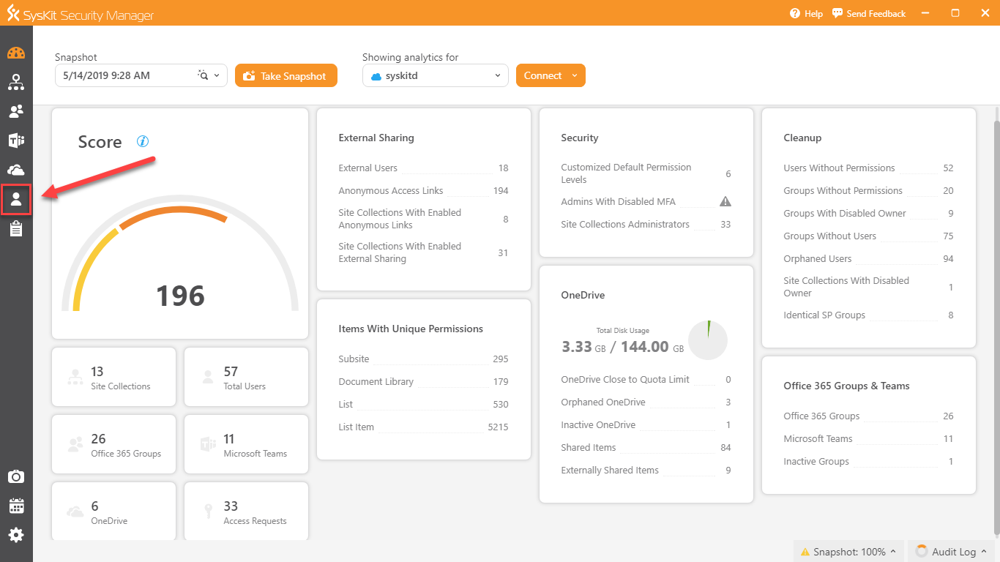
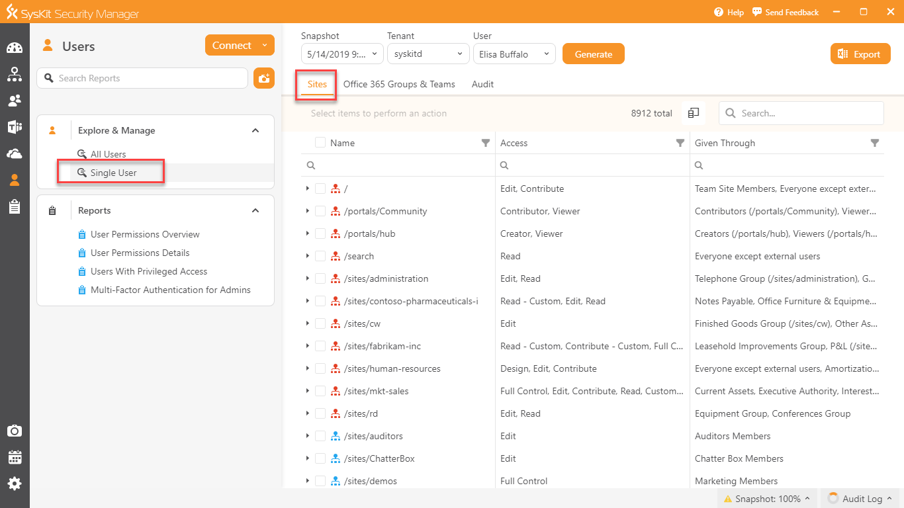
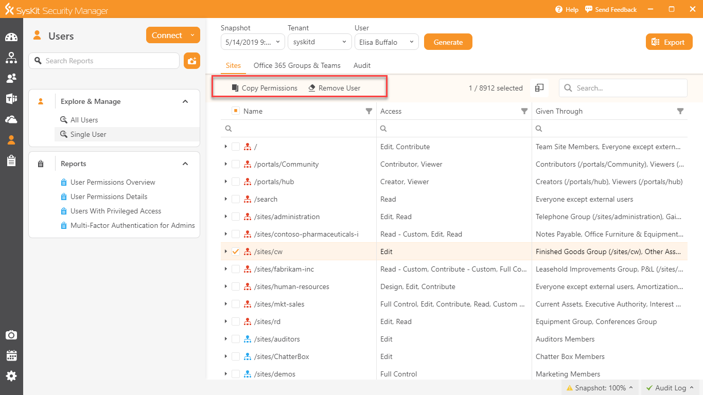
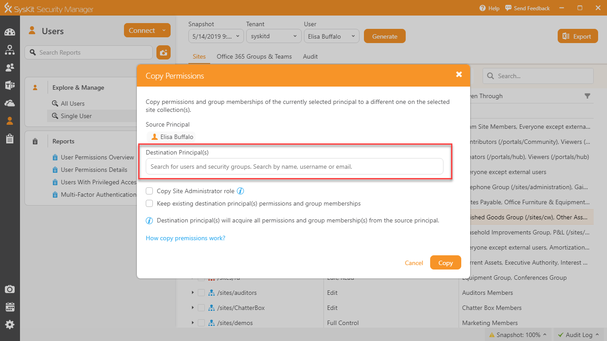
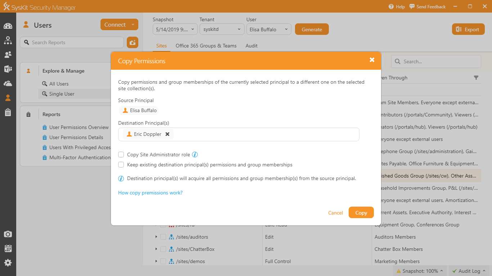
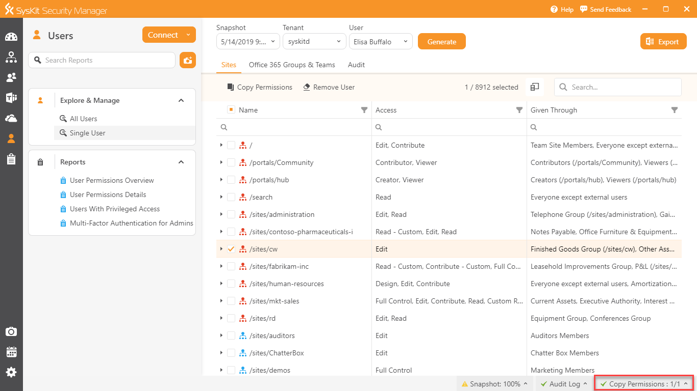
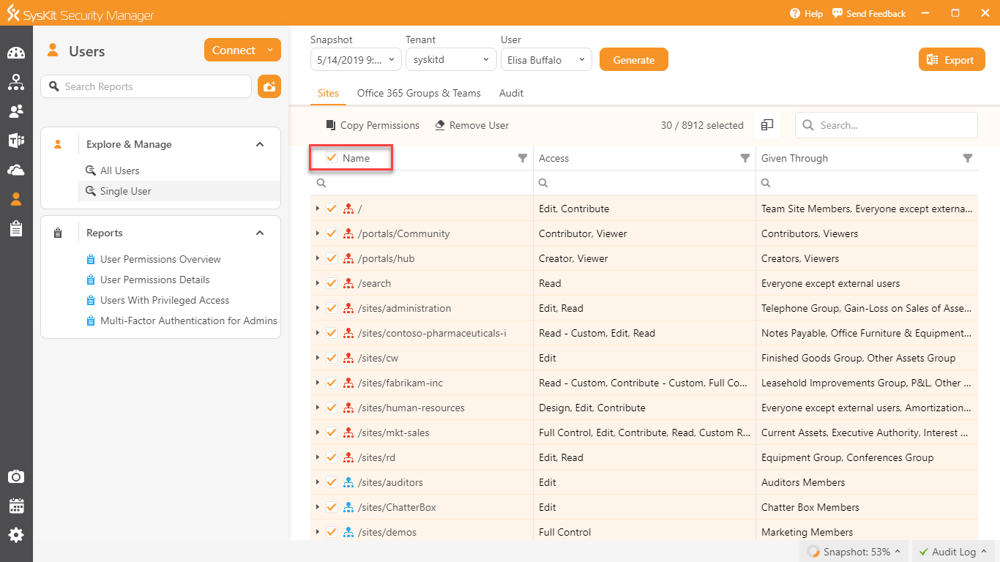

# Copy user permissions from one user to another

Managing user's permissions is very important regarding both Office 365 and SharePoint. When it comes to copying permissions from one user to another, you do not have a simple solution in the **Microsoft 365 admin center**.

A user may be granted permissions on various levels with different access rights. It would become very time-consuming to find and grant the same level of permissions to multiple users.

There are two common strategies to this problem. You can create a group and assign certain permissions to it. This way you can copy permissions by adding another user to the group.

The other way is to use a **PowerShell** script.

The best solution for this problem is to use **SysKit Security Manager** and copy permissions in a few mouse clicks.

Here are the required steps.

From the **Overview** screen, click on **Users**.

Select the **Single User** report from the section **Explore & Manage**. Choose your snapshot, tenant, and user and generate the report.

On the **Sites** tab of the **Single User** report, you will find a list of all the sites where the selected user has any kind of access. The sites include classic site collections, Office 365 Group site collections, and OneDrive sites.

If you mark for example the **/sites/cw** site collection, two available actions that are related to the user selected in the user filter will appear on the top of the grid.

Available actions are:

**Remove User** - Remove the selected user from the selected site collection\(s\).

**Copy Permissions** - Copy permissions and group memberships of the currently selected user to a different one on the selected site collection\(s\). Before performing an action, a user has two checkbox options available:

* _**Copy Site Administrator role**_ - if the source principal is the site collection administrator of the selected site\(s\), the target user will be added as the site administrator as well. 
* _**Keep existing destination principal\(s\) permissions and group membership**_ - the destination principal\(s\) will acquire all permissions and group membership\(s\) from the source principal. 


**Please note!** The following will not be copied: sharing links, OneDrive access, and Security Groups membership.


Let's click on the **Copy Permissions** link.

You need to select **Destination Principal\(s\)** and mark the checkboxes if they are applicable for your action.

We can put one destination principal and click on the **Copy** button.

You will see in the lower right corner in the status bar information about copying of the permission.

When you want to copy all the permissions of one user, mark a checkbox next to the **Name** column and select the **Copy Permissions** action.

