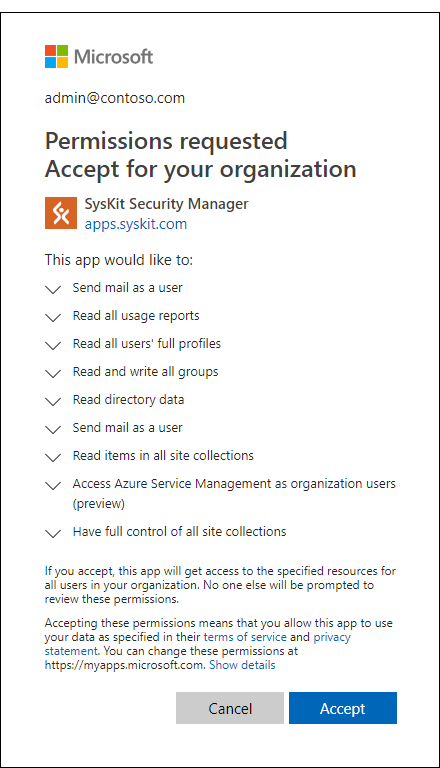
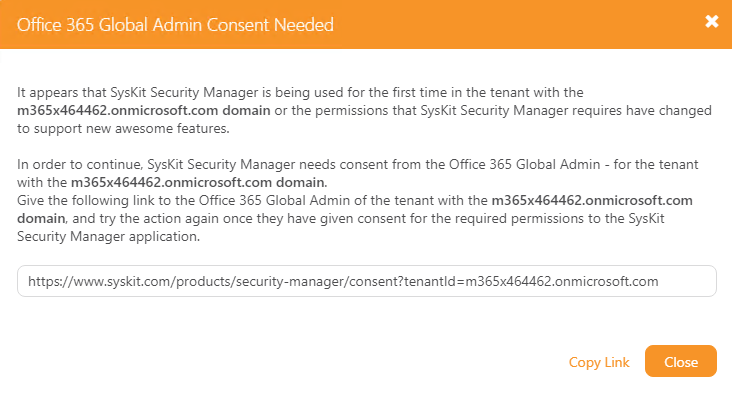

# User Permissions Requirements

To install SysKit Security Manager, you need to have **Local Administrator** privileges on the target installation computer.

Once installed SysKit Security Manager can be used with a non privileged user account.

To successfully manage SharePoint permissions, Office 365 Groups, and more, you need to have one of the following privileges on the desired Office 365 or SharePoint On-Premises environment:

* **Office 365 Global Administrator**
* **Farm Administrator**
* **Site Collection Administrator**

## Office 365 Considerations

To achieve its functionality, SysKit Security Manager is registered as an Azure Active Directory Application. The permissions model is based on OAuth and OpenID Connect flows. This enables us to consume all of the APIs provided by Microsoft in a standard and well defined way. It also enables us to use modern authentication including Multi-Factor Authentication.  
Because of this, when first connecting to an Office 365 tenant the user will be prompted to consent to a set of permissions that SysKit Security Manager requires to function properly. Additional prompts may show up in the future when installing a newer version of SysKit Security Manager because of new functionality and in consequence potentially new required permissions.

For more details on how permissions and consent work in Office 365 you can read the following [article](https://docs.microsoft.com/en-us/azure/active-directory/develop/v2-permissions-and-consent). Be warned, it gets a bit technical.  
The key takeaway from the article is the concept of effective permissions:


**Please note!**  
The effective permissions of an app will be the least privileged intersection of the delegated permissions the app has been granted \(via consent\) and the privileges of the currently signed-in user. Your app can never have more privileges than the signed-in user.


### Global Administrator Consent Considerations

If the account used to connect to the Office 365 tenant is a global administrator, consent can be given directly from SysKit Security Manager.

### Site Collection Administrator Consent Considerations

Unfortunately the procedure for using SysKit Security Manager with a normal user account is a bit more involved and will require the global administrator to intervene and give consent on behalf of the users in the organization. While there are permissions that the user itself can consent to, SysKit Security Manager require some for which only a global administrator can consent.

Once established that the account is a non global administrator account a window will be shown with a generated URL to give to the global administrator. The consent process can then be initiated by the global administrator.

Global administrators considering giving organization wide consent can learn more [here](global-admin-consent.md).

## SharePoint On-Premises Considerations

* Farm administrators have the possibility to **automatically discover** all site collections in a selected farm.
* To manage all site collections in a SharePoint farm, instead of adding yourself as a **Site Collection Administrator** on each site collection, you can have **Full Control** permissions granted in the Web Application Policy.

# Installation and database user permissions

There are two ways of installing SysKit Security Manager in regard to the database install location and the required user account permissions. 

### Default Installation

* SysKit Security Manager Setup will install and configure a new instance of **SQL Server 2012 Express LocalDB** named SysKitSecurityManagerInstance.
  * LocalDB instance can be located in the following directory:

    _%LOCALAPPDATA%\SysKit\Security Manager\Db_
* By default, access to the instance of LocalDB is limited to its owner.

### Advanced Installation

#### Creating a new database

 To be able to create a new SysKit Security Manager dedicated database, the user account running the installation and configuration wizard \(i.e. install account\) should be granted both the **dbcreator** and **securityadmin** roles on the preferred SQL Server. This allows the account to create a new database and to assign proper privileges after creation. The install account will be automatically given **db\_owner** privileges on the newly created database, if possible. Otherwise, it is advised that the account is given that privilege manually, as it is needed for upgrading the database. 

#### Using the existing database

 User running SysKit Security Manager will need to be granted the **db\_datareader** rights on the existing Syskit Security Manager database.

 ## Service account permissions

 **Service Configuration** wizard page requires appropriate service account details. The service account needs to have the following privileges to be able to run the service, create snapshots and other associated jobs:
 
 * **local administrator** privileges on this computer with UAC control disabled so we can verify your credentials
 * **db_owner** privileges on the created SysKit Security Manager dedicated database
 * **log on as Service** rights configured

 If the service account is outside your domain the account name must be typed in the down-level logon name format: *"domain\accountname"*
